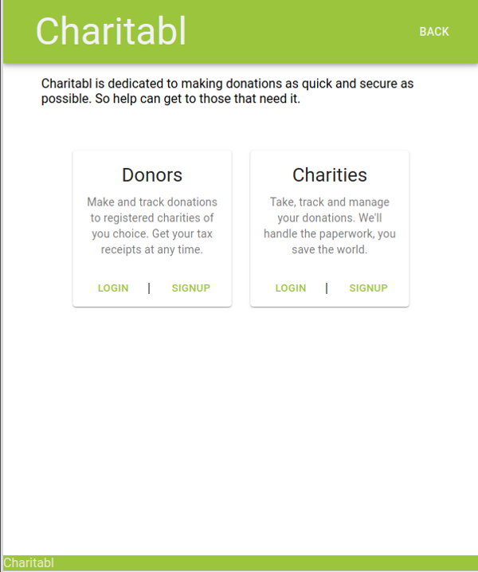

# Charitabl

Final project for Lighthouse Labs bootcamp. Not intended for production.

## Authors

- **John Webster** - _Front End, some Back End_ - [RandomHilarity](https://github.com/RandomHilarity)
- **Lucas Willow** - _Back End_ - [willow123red](https://github.com/willow123red)

## Images

## Companion Repos

This app requires Charitabl-API for server operations.
See [https://github.com/willow123red/charitabl-api](https://github.com/willow123red/charitabl-api).

## Prerequisites

### Dependencies

1. material-ui/core: 4.4.3
2. axios: 0.19.0
3. react: 16.10.1
4. react-dom: 16.10.1
5. react-qr-reader: 2.2.1
6. react-scripts: 3.1.2
7. react-stripe-elements: 5.0.1

## Available Scripts

In the project directory, you can run:

### `npm start`

Runs the app in the development mode. 
Open [http://localhost:3000](http://localhost:3000) to view it in the browser.

### `npm test`

Launches the test runner in the interactive watch mode.

### `npm run storybook`

Runs Storybook for independent component builds and testing.

### `npm run watch` (API directory)

Run postgres server and reload when changes are make.  Note db must be created first and ENV files created with appropriate logins.
